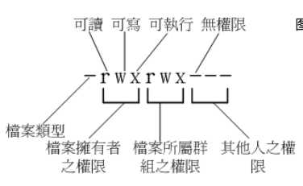

- info 查看命令使用说明 linux
- man 查看命令使用说明 unix link

## 文件权限(使用 -R 参数进行递归操作)

文件权限说明



- chgrp 修改文件所属群组

  ```bash
  chgrp groupname ./dir_or_filename
  ```
- chown 修改文件所属用户和群组

  ```bash
  chown username:groupname ./dir_or_filename
  ```
- chmod 修改文件权限

  数字权限说明`r(读): 4` `w(写): 2` `x(执行): 1`

  [所属用户][所属用户组][其他人员]
  [4+2][4][4]
  [读写][读][读]

  ```bash
  chmod 644 ./.bashrc
  ```
- chmod 使用 `ugo`配合`+-`操作进行文件权限的增加或减少

  ```bash

    # 分别给用户、群组、其他人员增加所有权限
  # 一个一个增加
  chmod u+rwx ./dir_or_filename
  chmod g+rwx ./dir_or_filename
  chmod o+rwx ./dir_or_filename
  # 或
  chmod u=rwx,g=rwx,o=rwx ./dir_or_filename
  # 或使用 a+表示所有的
  chmod a+rwx ./dir_or_filename
  # 或使用 a-表示所有的 去除所有权限
  chmod a-rwx ./dir_or_filename
  ```

## 文件操作

- pwd 显示当前路径全名 -P如果是链接会展示真正的路径
- mkdir 创建文件夹 -m 赋予权限 -p 递归创建

  ```bash
  mkdir -p /a/no/no/b
  ```
- rmdir 删除空目录 -p :连同“上层”“空的”目录也一起删除
- cp 复制文件 cp -a 完整复制包括权限 ；-r 递归复制目录; -u 只有当复制当文件更新的时候才复制，常用于备份；-s， -l 创建链接
- rm 移除文件或者目录 -r 递归删除目录root默认询问 y确定，或者\rm -r忽略
- mv 移动文件
- basename 获取文件名
- dirname 获取文件所在的文件夹名称
