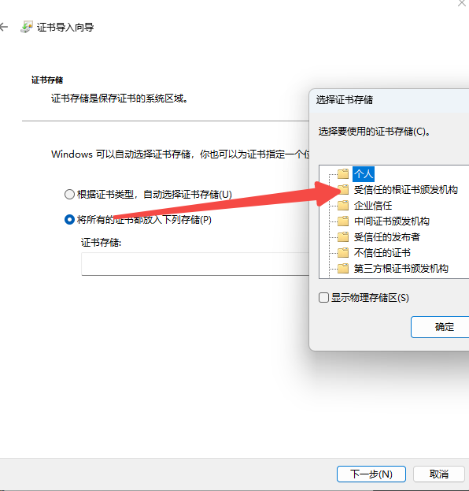

## windows下常用软件

1. [clash verge](https://clash-verge-rev.github.io/)
2. [everything](https://www.voidtools.com/zh-cn/downloads/)
3. [图吧工具箱](https://www.tbtool.cn/)
4. [进程监控工具procexp](https://learn.microsoft.com/en-us/sysinternals/downloads/process-explorer)
5. [端口管理工具tcpview](https://learn.microsoft.com/en-us/sysinternals/downloads/tcpview)
6. [host切换工具switchhost](https://switchhosts.vercel.app/zh)
7. [windows版redis memurai](https://www.memurai.com/get-memurai)
    
    win + r services.msc 找到memurai服务手动关闭
8. [WindowsTernimal](https://github.com/microsoft/terminal)
9. [powershell7](https://learn.microsoft.com/en-us/powershell/scripting/install/installing-powershell-on-windows?view=powershell-7.4&viewFallbackFrom=powershell-7&WT.mc_id=THOMASMAURER-blog-thmaure)

    设置ctrl + arrow 移动单词设置 
    ```
    Set-PSReadLineKeyHandler -Chord Ctrl+LeftArrow BackwardWord
    Set-PSReadLineKeyHandler -Chord Ctrl+RightArrow ForwardWord
    ```
10. java android 环境使用idea android studio
11. [开发环境下的https安全证书](https://github.com/FiloSottile/mkcert)
```bash
mkcert example.com "*.example.com" example.test localhost 127.0.0.1 ::1

mkcert --install
```
安装完成后需要手动信任证书,目录为
```bash
mkcert --CAROOT
```



12. [剪切板工具ditto](https://ditto-cp.sourceforge.io/)
13. [学习用激活工具win](https://github.com/zbezj/HEU_KMS_Activator/releases/download/42.0.4/HEU_KMS_Activator_v42.0.4.rar)
14. [学习用激活工具jetb](https://github.com/njzzzz/Jetbrains-Help)
15. [pws美化工具](https://starship.rs/zh-CN/guide/)
16. [win版本互转](https://github.com/TGSAN/CMWTAT_Digital_Edition/releases)